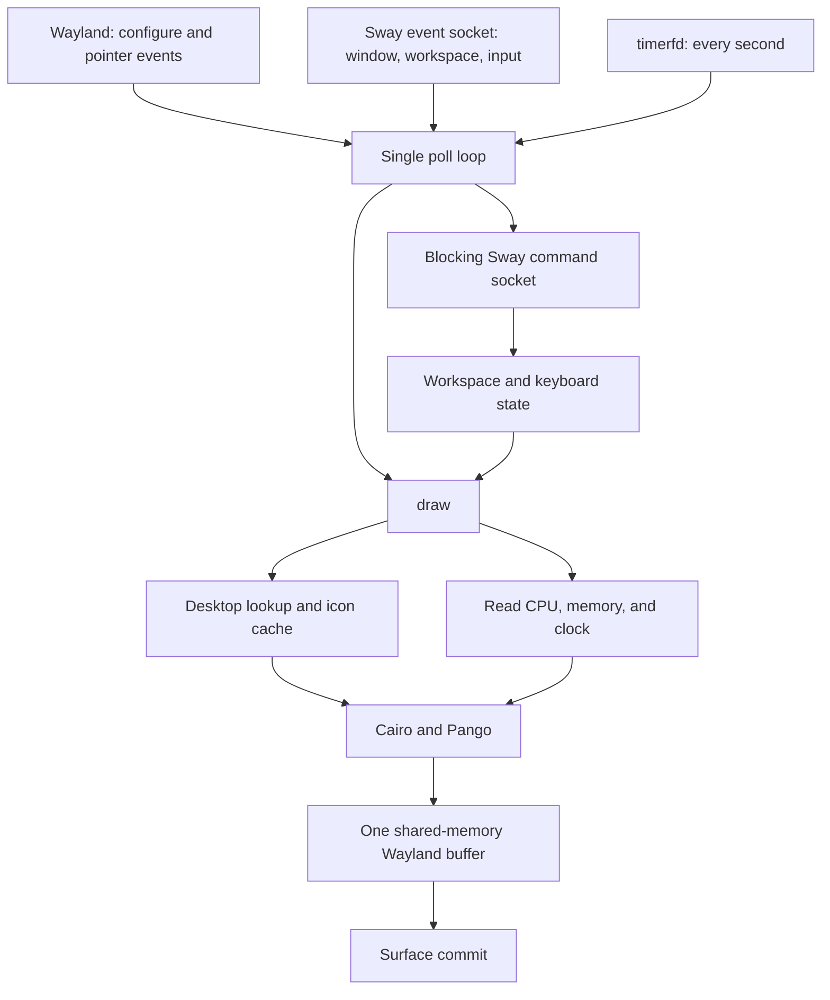

# Architecture review and optimization plan

Reviewed 2026-10-01 against the current working tree, including the existing
uncommitted changes. This document proposes changes; application code has not
been changed as part of the review.

Follow-up implementation: the five priorities summarized with this review are
now implemented: release-tracked resizeable buffers (`buffers.c`), timer-based
status snapshots, window event filtering with single-pass tree collection,
nonblocking Sway IPC (`ipc.c`), and retention/rasterization of visible icons.
The analysis below records the pre-change architecture. Output scaling,
width-aware layout, expanded icon-theme lookup, and dynamic workspace limits
remain separate follow-up work.

## Assessment

Keep the small C application, raw Wayland, and Cairo/Pango. The main opportunity
is to control when work happens and make resource ownership explicit. There is
no evidence yet that a toolkit rewrite, GPU renderer, or worker threads would
help enough to justify their cost.

Correct the shared-buffer lifecycle first. Then separate status sampling from
rendering, filter Sway events, and prevent icon-cache churn. Measure those
changes before adding partial repainting or more complex incremental state.

## Current architecture

Almost all application behavior lives in the 858-line `main.c`, with global
state shared between callbacks, IPC, status collection, and drawing.

| Area | Current behavior | Source |
| --- | --- | --- |
| Display | One bottom layer-shell surface, compositor-selected output, fixed 34px height | `main.c:44–93`, `726–786` |
| Event loop | Polls Wayland, Sway subscription, and a one-second timer | `main.c:808–855` |
| Sway transport | Separate event and command sockets; blocking reads/writes and synchronous replies | `main.c:272–348` |
| Workspace model | Up to 16 workspaces and 32 windows per workspace; repeated searches through a full tree | `main.c:350–450` |
| Input | Hit regions created during drawing; clicks issue numeric workspace commands | `main.c:452–508` |
| Icons | GIO desktop-ID / StartupWMClass lookup, fixed PNG/SVG search paths, 20-entry FIFO surface cache | `main.c:106–270` |
| Status | CPU and available memory sampled inside drawing; IPv4 every tenth timer notification; keyboard queried on input events | `main.c:510–616`, `694–704` |
| Rendering | Persistent Cairo/Pango objects; all text, icons, and background repainted and damaged each draw | `main.c:618–722` |
| Build/tests | Generated Wayland bindings; one test file includes `main.c` to exercise static icon functions | `Makefile`, `tests/icons.c` |

Useful optimizations already present: persistent Cairo/Pango objects, cached
icons and desktop catalog, persistent `/proc` descriptors, slower IP polling,
and draining queued Sway events before a refresh. Preserve these benefits.
Installation copies the binary, so repository builds do not replace the live bar.

## Evidence and limitations

- The installed binary and repository binary had identical SHA-256 hashes at
  review time. The live session had one 2560×1440 output at scale 1, two
  workspaces, three windows, and two distinct app IDs.
- A 15-second observation of the running bar measured approximately **0.53% of
  one CPU core**, **17,832 KiB RSS**, and **61.9 voluntary context switches per
  second**. This was an active desktop, not a controlled idle benchmark.
  Context switches alone do not establish the source of work or redraw count.
- `make check` failed because the configured layer-shell XML does not exist.
  The existing generated bindings allowed the tests to run with:
  `make -o /usr/share/wlr-protocols/unstable/wlr-layer-shell-unstable-v1.xml check`.
  Icon resolution, image loading, fallback, and cache checks passed. This does
  not validate a clean build or the live display/IPC lifecycle.
- Buffer ownership was checked against the installed Wayland protocol header:
  `/usr/include/wayland-client-protocol.h`, documentation for
  `wl_buffer.release` and `wl_surface.attach`.
- Benefits below are predictions from code paths, not measured speedups.

## Prioritized findings

### P0 — Shared-buffer ownership and resize handling

`draw()` writes to the same mapping on every invocation, with no
`wl_buffer.release` listener. The compositor can still be reading that storage
after a commit. This can produce inconsistent frames, especially during bursts.

`layer_configure()` updates `bar_width`, but the mapping, buffer stride, and
Cairo target are only allocated once. Subsequent width changes leave layout and
buffer geometry inconsistent. Height and output scale are also not modeled.

**Change:** introduce a small buffer owner with two slots, explicit busy/free
state, and release callbacks. Render only into a free slot; keep a pending dirty
flag if both are busy. Recreate size-dependent resources on configure, retaining
old busy storage until release. A frame callback can limit burst rendering but
must not be treated as permission to reuse storage. At the observed width, each
ARGB32 buffer is 340 KiB; a second buffer adds about 340 KiB of pixel storage.

Also handle display failures, advertised protocol versions, seat capability
removal, and allocation failures in this lifecycle. Integer output scaling can
follow once resize handling is correct; fractional scaling and multiple bars
are separate feature work.

### P1 — Sampling and presentation are coupled

`draw()` reads `/proc/stat` and `/proc/meminfo` every time, including workspace
and keyboard events. CPU deltas therefore reflect irregular intervals, and the
initial draw samples again immediately after priming. When event and timer FDs
are ready together, the loop can render twice consecutively.

**Change:** store a status snapshot sampled once per one-second deadline.
Prime CPU counters once and show an unavailable value until the first full
interval. Cache formatted module text. Rendering should consume snapshots and
perform no IPC, `/proc` reads, filesystem searches, or image decoding.
Collect changes from all ready sources and schedule one presentation afterward.
Use elapsed deadlines for slower jobs instead of counting timer reads; currently
multiple elapsed timer expirations count as only one tick.

### P1 — Sway events trigger excessive synchronous work

Every non-input event discards its payload and triggers `GET_WORKSPACES` plus
`GET_TREE`. Window title and window focus changes cause this work even though
the bar shows neither titles nor focused-window decoration. The existing drain
only combines messages already queued; it does not bound ongoing event storms.
Each workspace then searches the tree separately, giving worst-case traversal
work proportional to workspace count × tree size.

**Change:** inspect event type and `change`. Ignore events that cannot change
visible content, initially title/mark/window-focus updates. Use workspace-focus
payloads to update focus when they match the model. Coalesce membership changes
into one refresh, with at most one refresh in flight and one pending follow-up.
Traverse the returned tree once to collect apps by workspace identity. Retain a
full refresh for startup, uncertain transitions, and resynchronization.
Treat keyboard-layout changes separately from unrelated input events.

### P1 — Blocking I/O and disconnect handling can stall the UI

`read_all()` waits for a whole reply even after polling only establishes that
some bytes are available. Click callbacks also wait for command replies.
There are no IPC deadlines, header-magic checks, reply-size limits, or subscription
success checks. The outer loop ignores `POLLHUP` and `POLLERR`, potentially
spinning after a disconnect. Wayland flush errors/backpressure are ignored.

**Change:** use nonblocking IPC with incremental header/body parsing, a small
request queue, bounded payloads, response validation, and monotonic deadlines.
Handle partial writes, `EINTR`, `EAGAIN`, EOF, and broken pipes explicitly.
Keep all UI callbacks nonblocking. Integrate Wayland pending dispatch,
prepare/read/cancel, flush, and conditional `POLLOUT` handling into the poll
loop. Begin with a clean logged exit on compositor loss; reconnect is optional.
Bound per-iteration event processing so floods cannot starve the clock/display.

### P2 — Icon-cache capacity creates a performance cliff

The cache holds 20 IDs, while the model can display far more. A stable sequence
of more than 20 distinct IDs can evict entries before their next use and repeat
desktop lookup, file probes, and decoding on every frame. PNGs are retained at
source resolution and scaled repeatedly; SVGs are already rasterized at 22px.
Current search paths omit user icon directories and theme inheritance, even
though desktop-entry lookup itself uses GIO's XDG handling.

**Change:** resolve icons when workspace content changes, before presentation.
Keep references for all currently displayed unique IDs, plus a bounded cache
for inactive entries. Key raster surfaces by complete app ID and target pixel
size/scale. Normalize PNG/SVG results once with aspect-ratio preservation and
share one fallback glyph per size. Expand XDG/theme lookup as a distinct
compatibility change; preserve the documented restart-to-refresh behavior
initially. Replacing FIFO with a small LRU alone does not fix a working set
larger than the cache.

### P2 — Layout limits and missing build coverage

The two sides have no shared width budget, so icons and hit regions can overlap
status modules on crowded or narrow outputs. Non-numbered workspaces are shown
and selected using `num == -1`. Fixed-size strings and arrays silently truncate
state. The theme template is no longer consumed by the program. Existing tests
cover icons but not IPC, workspace parsing, presentation, or resize behavior.

**Change:** give layout an explicit available-width budget, clip hit regions to
visible workspace content, and use an overflow indicator when space runs out.
Retain full workspace identity and safely quote names in workspace commands.
Use owned strings and sized collections, with explicit limits for unreasonable
inputs. Remove or document the unused template. Make protocol XML dependencies
discoverable/configurable and exercise a clean build in the supported environment.

## Implementation sequence

Each step should be a separately reviewable change. Extract modules only as
their responsibilities are changed; avoid a large mechanical split first.

| Step | Deliverable | Acceptance check |
| --- | --- | --- |
| 1 | Reproducible build and optional counters for draws, queries, samples, icon loads, and processing time | Clean build and current icon tests pass; capture comparable idle and activity baselines |
| 2 | Wayland buffer ownership, resize resources, and error handling | Never write a busy buffer; resize repeatedly; delayed release and disconnect do not corrupt or spin |
| 3 | Cached status snapshot, dirty flags, one presentation scheduler | CPU samples once per deadline regardless of event rate; simultaneous timer/event readiness produces one scheduled draw |
| 4 | Event classification and single-pass workspace collection | Title/focus storms cause no tree queries when visible content is unchanged; open/close/move and workspace changes stay correct |
| 5 | Nonblocking IPC and complete poll integration | Fragmented/delayed replies do not freeze display processing; malformed input and disconnects terminate predictably |
| 6 | Visible-icon ownership and pre-sized raster cache | More than 20 distinct visible apps cause zero repeat loads after warmup; memory stabilizes as apps churn |
| 7 | Width-aware layout and state-limit cleanup | Narrow output, long IDs, named workspaces, and large workspace/window counts render and hit-test consistently |

Steps 3 and 4 should provide the first measurable reductions in routine work.
Step 2 takes priority because its ownership rules are required for safe rendering.

The eventual boundaries can stay small:

- `main.c`: application ownership, scheduler, initialization, shutdown.
- `wayland.c`: protocol objects, outputs, input callbacks, buffer lifecycle.
- `sway.c`: transport, framing, request queue, event classification.
- `model.c`: workspace/input snapshots and tree-to-model parsing.
- `metrics.c`: scheduled CPU, memory, clock, and IP collection.
- `render.c`: layout, hit regions, Cairo/Pango drawing from snapshots.
- `icons.c`: desktop resolution, rasterization, and icon ownership.

Use one application context with explicit owners instead of cross-module mutable
globals. The renderer receives snapshots and prepared assets; input callbacks
enqueue actions. Keep one thread until measurements show a need for another.

## Validation and stopping criteria

Benchmark the same binary configuration and desktop workload before and after:
60 seconds idle with the seconds clock visible, repeated workspace changes,
window/title event bursts, and an icon working set larger than 20. Record CPU
time, RSS, wakeups/context switches, query/commit counts, icon loads, and event
handling latency. Do not infer speedups from the current short sample.

Add focused tests around changed boundaries: socket-pair tests for fragmented
IPC and failure paths; JSON fixtures for tiled/floating/XWayland and named
workspaces; timer/event scheduling checks; cache working-set tests. Exercise
buffer release, resize, output changes, and pointer hit testing in a disposable
Wayland session. Run memory/undefined-behavior checks on these paths.

The first target is one metrics sample and one clock-driven commit per second
at idle, no tree query for irrelevant window events, no steady-state icon I/O,
and no UI-blocking socket operation. The seconds clock means zero idle wakeups
is not an appropriate goal. Preserve current appearance and responsiveness.

Defer partial repainting until profiling shows full-strip rendering matters:
the observed strip is only 340 KiB. If partial redraw is introduced, track each
buffer's content generation or repaint from a valid cached image; alternating
buffers otherwise risks stale pixels. Similarly, keep the existing slow IP
poll until its measured cost justifies a netlink event source.
